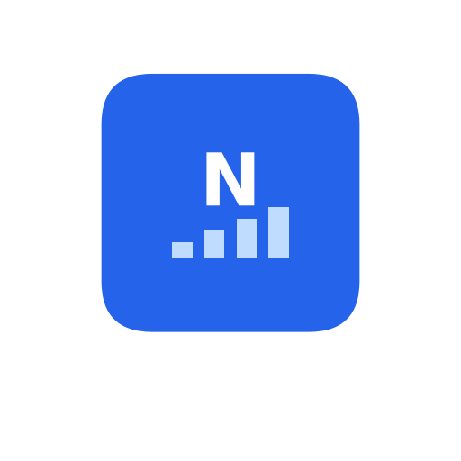

<div align="center">
  

  <h1>Nivesh AI — AI-Powered Equity Research</h1>
</div>

**Nivesh AI** is a locally-deployed AI assistant that fetches financial data, runs
multi-agent LLM analysis, and generates professional, multi-page equity research
reports for **Indian (NSE/BSE) and global stocks** — for free, using Yahoo Finance
as the data source.

> **Nivesh AI is a derivative work built on the open-source
> [FinRobot](https://github.com/AI4Finance-Foundation/FinRobot) project,
> distributed under the Apache License 2.0.** It is **not** the official FinRobot
> product and is **not** affiliated with or endorsed by the AI4Finance Foundation.
> See [Attribution & License](#attribution--license).

---

## ✨ What it does

- **Automated equity research reports** — professional multi-page HTML/PDF with 15+ chart types
- **Financial analysis** — income statement, balance sheet, cash flow, ratios (3–5 years)
- **Forecasts & valuation** — 3-year projections, DCF, EV/EBITDA & peer comparison
- **AI agent analysis** — specialized LLM agents write the investment thesis, risk
  assessment, valuation overview, competitor analysis, news summary, and more
- **Indian-market ready** — works with `.NS` / `.BO` tickers, renders figures in ₹
  (currency auto-detected per listing)

## 🔑 Key difference from upstream FinRobot

The original FinRobot equity module sourced data from **Financial Modeling Prep
(FMP)**, whose Indian-market fundamentals require a paid plan (and whose legacy
endpoints were retired). Nivesh AI **migrates the data layer to Yahoo Finance**
(`yfinance`), so:

- ✅ Indian stocks (Adani, Reliance, TCS, …) work out of the box
- ✅ No FMP subscription or API key required
- ✅ Only an **OpenAI API key** is needed (for the AI-written sections)

> Note: Yahoo Finance is a free, unofficial source and may rate-limit under heavy
> use. Fine for research and demos; consider a commercial data vendor for production.

---

## 🚀 Quick start

**1. Configure your API key**

On first launch the app auto-creates `finrobot_equity/core/config/config.ini` from
the bundled template, so you can just run it and then edit the file. (To create it
manually instead: `cp finrobot_equity/core/config/config.ini.example finrobot_equity/core/config/config.ini`.)

Edit `finrobot_equity/core/config/config.ini` and set your OpenAI key:

```ini
[API_KEYS]
openai_api_key = YOUR_OPENAI_API_KEY     # https://platform.openai.com/account/api-keys
openai_model   = gpt-4.1-mini            # cheap & fast; use gpt-4.1 for best quality
# fmp_api_key is optional / unused — data comes from Yahoo Finance
```

**2. Install and run the web app**

```bash
python3 -m venv venv
source venv/bin/activate
pip install -r requirements-equity.txt
python run_web_app.py
```

Open **http://127.0.0.1:8001**

**3. Log in**

A default admin is created on first launch and its generated password is printed in
the console. (You can create additional accounts from the login screen.)

**4. Generate a report**

In the left panel enter a ticker and company name, e.g.:

| Field | Value |
|---|---|
| Ticker | `ADANIENT.NS` |
| Company Name | `Adani Enterprises Limited` |

then click **Generate Research Report**. Watch the progress card; when complete,
open the **HTML** or **PDF** from the Research Archive.

---

## 💻 Command-line usage

```bash
# Step 1 — financial analysis + AI text sections
python finrobot_equity/core/src/generate_financial_analysis.py \
    --company-ticker ADANIENT.NS \
    --company-name "Adani Enterprises Limited" \
    --config-file finrobot_equity/core/config/config.ini \
    --generate-text-sections

# Step 2 — build the report
python finrobot_equity/core/src/create_equity_report.py \
    --company-ticker ADANIENT.NS \
    --company-name "Adani Enterprises Limited" \
    --analysis-csv finrobot_equity/output/ADANIENT.NS/analysis/financial_metrics_and_forecasts.csv \
    --ratios-csv  finrobot_equity/output/ADANIENT.NS/analysis/ratios_raw_data.csv \
    --config-file finrobot_equity/core/config/config.ini \
    --enable-valuation-analysis
```

US tickers work too (e.g. `AAPL`, `NVDA`). For global tickers use the Yahoo Finance
suffix (`.NS` NSE, `.BO` BSE, `.L` LSE, etc.).

---

## 🧱 Pipeline

1. **Fetch** financial data from Yahoo Finance (statements, ratios, price history, news)
2. **Process & forecast** — projections, DCF valuation, peer comparison
3. **AI agent analysis** — LLM agents generate the written report sections
4. **Report generation** — professional HTML / PDF with charts (currency-aware)

---

## 💸 Cost

Data is free (Yahoo Finance). The only cost is OpenAI usage for the AI-written
sections — roughly **$0.20–0.40 per report on `gpt-4.1`**, or **~$0.03–0.06 on
`gpt-4.1-mini`**.

---

## 📁 Project layout

```
finrobot_equity/
├── core/
│   ├── config/            # config.ini (your keys — git-ignored)
│   └── src/
│       ├── generate_financial_analysis.py   # Step 1
│       ├── create_equity_report.py           # Step 2
│       └── modules/
│           ├── market_data_api.py            # Yahoo Finance data layer
│           ├── financial_data_processor.py
│           ├── valuation_engine.py
│           └── html_template_professional.py # report rendering (currency-aware)
├── web_app/               # FastAPI web interface
└── output/                # generated reports (git-ignored)
```

---

## ⚖️ Disclaimer

Nivesh AI generates **AI-assisted analysis for informational and educational
purposes only**. It is **not financial advice** and should not be used as the sole
basis for any investment or trading decision. Always consult a qualified financial
professional. Past performance is not indicative of future results.

---

## 📜 Attribution & License

Nivesh AI is licensed under the **Apache License, Version 2.0**, the same license as
the upstream FinRobot project.

- Built on **[FinRobot](https://github.com/AI4Finance-Foundation/FinRobot)** © 2024–2026 AI4Finance Foundation
- Modifications © 2026 Nivesh AI (see [`NOTICE`](NOTICE) for the list of changes)
- "FinRobot" and "AI4Finance" are trademarks of AI4Finance Foundation and are used
  here only to truthfully acknowledge the upstream project.

The full license text is in [`LICENSE`](LICENSE); the required attribution notice is
in [`NOTICE`](NOTICE). Both must be retained in any redistribution.
